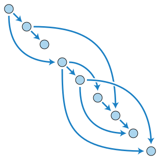
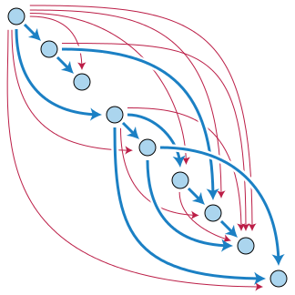

# gitadv

[TOC]

## Installs

### MultiOS

[VisualStudioCode](https://code.visualstudio.com/download)

[Markdown viewer for VSCODE](https://marketplace.visualstudio.com/items?itemName=hbrok.markdown-preview-bitbucket)

### Mac
[Git](https://git-scm.com/download/mac)
[Source Tree](https://www.sourcetreeapp.com/)

### Windows
[Git](https://git-scm.com/download/win)
[Chocolatey](https://chocolatey.org/packages/git)
[Git Extensions](http://gitextensions.github.io/)
[Commander](http://cmder.net/)

### Linux
[Git kraken](https://www.gitkraken.com/download)

$ sudo dnf install git-all
$ sudo apt install git-all

## First command
git help

## DAG

Computer science concept

* One Direction
* Not allowed to go back to a parent

